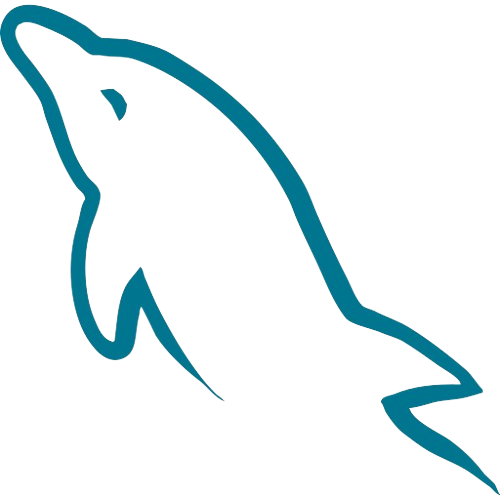
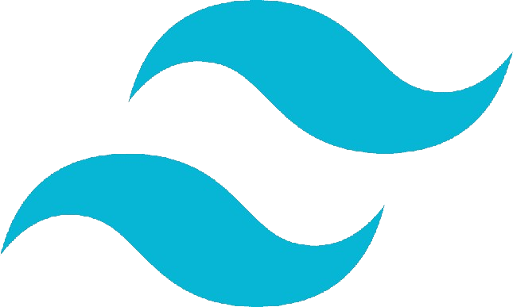

## ¿Qué puedo hacer?

- Desarrollo de front-end
- Desarrollo de back-end
- Bases de datos
- Control de versiones
- Metodologías ágiles

## ¿Qué me apasiona?

- Aprender nuevas tecnologías y frameworks.
- Encontrar soluciones creativas a problemas complejos.
- Trabajar en equipo y colaborar con otros desarrolladores.

## ¿Qué me diferencia?

- Tengo una gran capacidad de aprendizaje y adaptación.
- Soy proactivo y tengo iniciativa.
- Soy responsable y cumplo con mis plazos.
- Tengo una buena capacidad de comunicación y trabajo en equipo.

## Mis estadísticas de GitHub

## Tecnologías y herramientas que uso

<table>
  <tr>
    <th>HTML</th>
    <th>CSS</th>
    <th>JavaScript</th>
    <th>SASS</th>
    <th>Python</th>
    <th>PHP</th>
    <th>TypeScript</th>
    <th>MySQL</th>
  </tr>
  <tr>
    <td>
      
    </td>
    <td>
      
    </td>
    <td>
      
    </td>
    <td>
      
    </td>
    <td>
      
    </td>
    <td>
      
    </td>
    <td>
      
    </td>
    <td>
      
    </td>
  </tr>
  <tr>
    <th>JAVA</th>
    <th>React</th>
    <th>MongoDB</th>
    <th>NodeJs</th>
    <th>Express</th>
    <th>WordPress</th>
    <th>Mongoose</th>
    <th>Tailwind</th>
  </tr>
  <tr>
    <td>
      
    </td>
    <td>
      
    </td>
    <td>
      
    </td>
    <td>
      
    </td>
    <td>
      
    </td>
    <td>
      
    </td>
    <td>
      
    </td>
    <td>
      
    </td>
  </tr>
</table>
